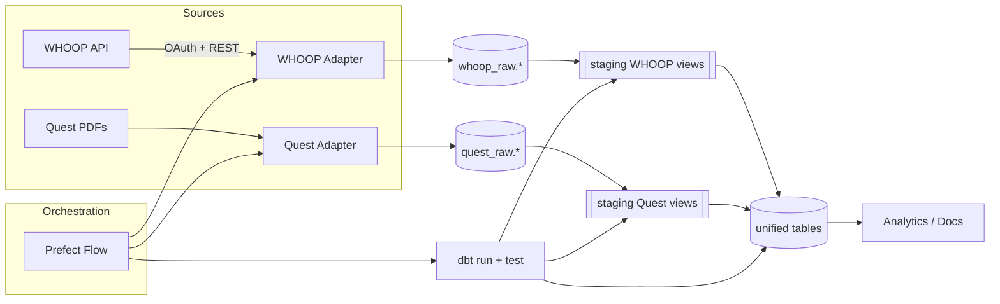

docker compose up -d
dbt run
dbt test
dbt docs generate
dbt docs serve
# Health Data Aggregator


Minimal personal health data stack (WHOOP + Quest labs) showcasing Python ingestion + dbt modeling + Prefect orchestration.

---
## Architecture Diagram


Minimal personal health data stack (WHOOP + Quest PDF labs) showcasing Python ingestion + dbt modeling.

---
## 1. Quick Start (TL;DR)
```powershell
git clone <this repo>
cd health-data-whoop-agg
Copy-Item .env.example .env
docker compose up -d   # start Postgres
python -m venv .venv
.\.venv\Scripts\Activate.ps1
pip install -r requirements.txt
python -m health_data.cli.main bootstrap
python -m health_data.cli.main whoop auth   # browser opens; approve
python -m health_data.cli.main whoop ingest # pulls raw data

# dbt profile (one-time)
New-Item -ItemType Directory -Force $env:USERPROFILE\.dbt | Out-Null
Copy-Item dbt\profiles.example.yml $env:USERPROFILE\.dbt\profiles.yml

dbt debug   # verify connection
dbt run
dbt test
```


Optional Quest labs ingestion (PDF only):
```powershell
python -m health_data.cli.main ingest-pdf --path path\to\labs --patient-id self
```

---
## 2. Concepts
- Raw layer: `whoop_raw.*`, `quest_raw.*` store source payloads (idempotent upserts from API and PDF).
- Modeling: dbt staging (`staging` schema) selects/renames; unified models (`unified` schema) produce analytics-friendly tables.
- Orchestration: Prefect flow (optional) chains ingest + dbt (`python -m orchestration.flows run-full-refresh`).

---
## 3. Detailed Setup
1. Environment file: edit `.env` with WHOOP credentials (create a developer app). 
2. Start database: `docker compose up -d` (Postgres running on localhost:5432).
3. Install Python deps inside virtualenv.
4. Bootstrap schemas: applies `schema.sql` (safe to rerun).
5. Authenticate & ingest WHOOP.
6. Create dbt profile from `dbt/profiles.example.yml` (or set `DBT_PROFILES_DIR=./dbt`).
7. Run `dbt run` + `dbt test` to build/test unified layer.

---
## 4. Running Again / Daily Use
Pull previous UTC day only:
```powershell
python -m health_data.cli.main whoop ingest --daily-refresh
dbt run --select unified_sleep_sessions unified_workouts unified_vitals
```

Add new Quest PDFs then rebuild labs:
```powershell
python -m health_data.cli.main ingest-pdf --path new_labs --patient-id self
```

Full end-to-end via Prefect (optional):
```powershell
python -m orchestration.flows run-full-refresh --quest-path path\to\labs
```

---
## 5. Project Structure (Essentials)
```
schema.sql                 # bootstrap DDL (raw + unified)
health_data/               # Python package
  sources/                 # adapters (whoop, quest)
  db/unified.py            # Python transform helpers (residual, optional)
  cli/main.py              # CLI entry
dbt/
  dbt_project.yml          # dbt configuration
  models/staging/          # staging views
  models/unified/          # incremental unified models + tests yaml
  macros/                  # reusable Jinja macros
orchestration/flows.py     # Prefect flows (ingest + dbt)
```

---
## 6. Common Commands
```powershell
python -m health_data.cli.main whoop auth
python -m health_data.cli.main whoop ingest --since 2025-09-01T00:00:00Z --until 2025-09-05T00:00:00Z
python -m health_data.cli.main ingest-pdf --path labs --patient-id self
dbt run --select unified_sleep_sessions
dbt test
dbt docs generate
dbt docs serve
```

---
## 7. Troubleshooting
- Missing profiles.yml warning: copy `dbt/profiles.example.yml` to `%USERPROFILE%\.dbt\profiles.yml` or export `DBT_PROFILES_DIR`.
- 401 WHOOP: delete `.token_store.json`, re-run auth.
- Empty unified tables: ensure you ran ingest before `dbt run`.
- Network/SSL errors: rerun; upserts are idempotent.

---
## 8. Extending (Quick Notes)
Add a new source: create adapter under `health_data/sources/<name>/`, raw upsert in `db.py`, staging model, unified model, tests.

---
## 9. License
Personal / educational usage. See repository for details.
